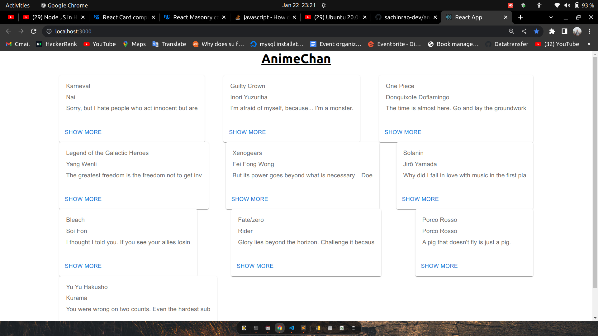

## Project Description

This is a React Web Application that displays quotes from anime using the AnimeChan API

## Technology Used :

- ReactJs : JavaScript's library React.js is used to develop the application.
- JavaScript :  JavaScript's basics and some advanced concepts 
- JSX : JavaScript XML is used to structure the page and using Different UI components inside React.js.
- Make style : React Style for the styling
- MUI : react MUI

## What I've Learnt :

I have Learnt :
- In this project, I learnt MUI pagination, MUI masonry, MUI Card.
- And also learnt about make style
## Setup Project

Get a clone of application from [Here](https://github.com/sachinrao-dev/anime-chan-responsive-website)
### `npm start`

Runs the app in the development mode. Open [http://localhost:3000](http://localhost:3000) to view it in your browser.
The page will reload when you make changes. You may also see any lint errors in the console.

## Initial View of Application

## After clicked the show more button 

